# 第1章 大数据开篇与Hadoop搭建

## 大数据课程导论

### 大数据概念

最早提出“大数据”时代到来的是全球知名咨询公司麦肯锡，大数据是当前很热的一个词。这几年来，云计算、继而大数据，成了整个社会的热点，大数据究竟是什么东西?有哪些相关技术?对普通人的生活会有怎样的影响?我们来一步步弄清这些问题。

#### CCTV9——大数据时代

中国首部大数据产业题材纪录片——《大数据时代》于7月1日20:04分在央视9套纪录频道首播，该片由中央广播电视总台与工业和信息化部联合出品、工业和信息化部信息化和软件服务业司指导、央视纪录频道和国家工业信息安全发展研究中心联合摄制。该片是国内首部大数据产业题材纪录片，节目细致而生动地讲述了大数据技术在政府治理、民生服务、数据安全、工业转型、未来生活等方面给我们带来的改变和影响。

#### 数据

在讲什么是大数据之前，我们首先需要理清数据的基本概念。数据是可以获取和存储的信息，直观而言，表达某种客观事实的数值是最容易被人们识别的数据(因为那是“数”)。但实际上，人类的一切语言文字、图形图画、音像记录，所有感官可以察觉的事物，只要能被记下来，能够查询到，就都是数据(data)。

随着互联网快速发展、智能手机以及“可佩带”计算设备的出现，我们的行为、位置，甚至身体生理数据等每一点变化都成为了可被记录和分析的数据。这些新技术推动着大数据时代的来临，各行各业每天都在产生数量巨大的数据碎片，数据计量单位已从Byte、KB、MB、GB、TB发展到PB、EB、ZB、YB甚至BB来衡量。

#### 数据存储单位

**常见数据存储单位：**

1Byte = 8bit 1K(千)= 1024Byte 1MB（兆)=1024K 1G(吉) = 1024M

1T(太)=1024G 1P(拍)=1024T 1E(艾)=1024P 1Z(泽)=1024E

1Y (尧)=1024Z 1B(布)=1024Y 1N(诺)=1024B 1D(刀)=1024N

#### 大数据

大数据（big
data），是指无法在一定时间范围内用常规软件工具进行捕捉、管理和处理的数据集合，是需要新处理模式才能具有更强的决策力、洞察发现力和流程优化能力的海量、高增长率和多样化的信息资产。

#### 大数据要解决的问题

数据分析的前提是有数据，数据存储的目的是支撑数据分析。究竟怎么去存储庞大的数据量，是开展数据分析的企业在当下面临的一个问题。传统的数据存储模式存储容量是有大小限制或者空间局限限制的，怎么去设计出一个可以支撑大量数据的存储方案是开展数据分析的首要前提。

当解决了海量数据的存储问题，接下来面临的海量数据的计算问题也是比较让人头疼，因为企业不仅追求可以计算，还会追求计算的速度、效率。

以目前互联网行业产生的数据量级别，要处理这些数据，就需要一个更好、更便捷的分析计算方式了。传统的显然力不从心了，而且效率也会非常低下。这正是传统数据分析领域面临的另一个挑战，如何让去分析、计算。这个时候就需要有新的技术去解决这些问题，这个技术就是大数据。

大数据主要解决的问题: 海量数据的**存储**和海量数据的**计算**问题

### 大数据的特点（5V）

大数据的特点可以使用5个字来概括：**大、多、值、快、信**

#### Volume

**大**
数据的采集，计算，存储量都非常的庞大。是数据体量巨大(Volume)。截至目前，人类生产的所有印刷材料的数据量是200PB(1PB=210TB)，而历史上全人类说过的所有的话的数据量大约是5EB(1EB=210PB)。当前，典型个人计算机硬盘的容量为TB量级，而一些大企业的数据量已经接近EB量级。

#### Variety

**多**种类和来源多样化。种类有：结构化、半结构化和非结构化数据等，常见的来源有：网络日志、音频、视频、图片等等。

#### Value

**值**大数据价值密度相对较低。如随着物联网的广泛应用，信息感知无处不在，信息海量，但价值密度较低，存在大量不相关信息。因此需要对未来趋势与模式作可预测分析，利用机器学习、人工智能等进行深度复杂分析。而如何通过强大的机器算法更迅速地完成数据的价值提炼，是大数据时代亟待解决的难题。

#### Velocity

**快**
数据增长速度快，处理速度也快，获取数据的速度也要快。这是大数据区分于传统数据挖掘的最显著特征。根据IDC的“数字宇宙”的报告，预计到2020年，全球数据使用量将达到35.2ZB。在如此海量的数据面前，处理数据的效率就是企业的生命。

2019年11月11日，**阿里巴巴**天猫成交额达2684亿元，2018年为2135亿元。

#### Veracity

**信** 数据的准确性和可信赖度，即数据的质量。

### 大数据应用场景

#### 电商方面

精准广告位，通过对用户的浏览行为，点击行为等进行大数据采集，分析，挖掘用户的二层三层喜欢，扩大产出。

#### 传媒方面

猜你喜欢，通过对受众人群机型大数据分析，结合对应算法，对受众喜欢的进行交互推荐。

#### 金融领域

理财投资，通过对个人的信用评估，风险承担能力评估，集合众多理财产品、推荐响应的投资理财产品。

#### 交通方面

目前，交通的大数据应用主要在两个方面:一方面通过对车流量等海量数据的收集，估算，预测该路段一定时间内的车流量情况，给用户提供便利，合理进行道路规划；另一方面可以利用大数据来实现即时信号灯调度，提高已有线路通行能力。

#### 电信方面

智慧营业厅，通过对用户当前的行为习惯、偏好，节假日的相应数据变化，调节自身业务结构，做到按需分配。

#### 安防方面

人脸识别，通过人脸识别，--匹配，存储用户数据，结合人工智能，分析及甄别用户行为，预防犯罪行为发生

#### 医疗方面

智慧医疗，通过对海量病例大数据的存储，匹配、检索、结合用户的饮食、行为等习惯，搭建智慧医疗体系。

### 大数据业务分析基本步骤

典型的大数据分析包含以下几个步骤：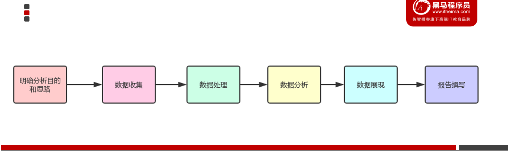

#### 明确分析目的和思路

明确数据分析目的以及确定分析思路，是确保数据分析过程有效进行的先决条件，它可以为数据的收集、处理及分析提供清晰的指引方向。

目的是整个分析流程的起点。目的不明确则会导致方向性的错误。即思考:为什么要开展数据分析，通过这次数据分析要解决什么问题？

当明确目的后，就要校理分析思路，并搭建分析框架，把分析目的分解成若干个不同的分析要点，即如何具体开展数据分析，需要从哪几个角度进行分析，采用哪些分析指标。只有明确了分析目的，分析框架才能跟着确定下来，最后还要确保分析框架的体系化，使分析更具有说服力。

体系化也就是逻辑化，简单来说就是先分析什么，后分析什么，使得各个分析点之间具有逻辑联系。避免不知从哪方面入手以及分析的内容和指标被质疑是否合理、完整。所以体系化就是为了让你的分析框架具有说服力。

要想使分析框架体系化，就需要一些营销、管理等理论为指导，结合着实际的业务情况进行构建，这样才能保证分析维度的完整性，分析结果的有效性以及正确性。比如以用户行为理论为指导，搭建的互联网网站分析指标框架如下：

把跟数据分析相关的营销、管理等理论统称为数据分析方法论。比如用户行为理论、PEST分析法、5W2H分析法等等，详细请查阅附件资料。

#### 数据收集

数据收集是按照确定的数据分析框架，收集相关数据的过程，它为数据分析提供了素材和依据。这里所说的数据包括第一手数据与第二手数据，第一手数据主要指可直接获取的数据，第二手数据主要指经过加工整理后得到的数据。一般数据来源主要有以下几种方式：

数据库：每个公司都有自己的业务数据库，存放从公司成立以来产生的相关业务数据。这个业务数据库就是一个庞大的数据资源，需要有效地利用起来。

公开出版物：可以用于收集数据的公开出版物包括《中国统计年鉴》《中国社会统计年鉴》《中国人口统计年鉴》《世界经济年鉴》《世界发展报告》等统计年鉴或报告。

互联网：随着互联网的发展，网络上发布的数据越来越多，特别是搜索引擎可以帮助我们快速找到所需要的数据，例如国家及地方统计局网站、行业组织网站、政府机构网站、传播媒体网站、大型综合门户网站等上面都可能有我们需要的数据。

市场调查：进行数据分析时，需要了解用户的想法与需求，但是通过以上三种方式获得此类数据会比较困难，因此可以尝试使用市场调查的方法收集用户的想法和需求数据。

#### 数据处理

数据处理是指对收集到的数据进行加工整理，形成适合数据分析的样式，它是数据分析前必不可少的阶段。数据处理的基本目的是从大量的、杂乱无章、难以理解的数据中，抽取并推导出对解决问题有价值、有意义的数据。

数据处理主要包括数据清洗、数据转化、数据提取、数据计算等处理方法。一般拿到手的数据都需要进行一定的处理才能用于后续的数据分析工作，即使再“干净”’的原始数据也需要先进行一定的处理才能使用。

数据处理是数据分析的基础。通过数据处理，将收集到的原始数据转换为可以分析的形式，并且保证数据的一致性和有效性。

#### 数据分析

数据分析是指用适当的分析方法及工具，对处理过的数据进行分析，提取有价值的信息，形成有效结论的过程。由于数据分析多是通过软件来完成的，这就要求数据分析师不仅要掌握各种数据分析方法，还要熟悉数据分析软件的操作。

数据挖掘其实是一种高级的数据分析方法，就是从大量的数据中挖掘出有用的信息，它是根据用户的特定要求，从浩如烟海的数据中找出所需的信息，以满足用户的特定需求。数据挖掘技术是人们长期对数据库技术进行研究和开发的结果。一般来说，数据挖掘侧重解决四类数据分析问题:分类、聚类、关联和预测，重点在寻找模式和规律。数据分析与数据挖掘的本质是一样的，都是从数据里面发现关于业务的知识。

#### 数据展现

一般情况下，数据是通过表格和图形的方式来呈现的，我们常说用图表说话就是这个意思。常用的数据图表包括饼图、柱形图、条形图、折线图、散点图、雷达图等，当然可以对这些图表进一步整理加工，使之变为我们所需要的图形，例如金字塔图、矩阵图、漏斗图等。

大多数情况下，人们更愿意接受图形这种数据展现方式，因为它能更加有效、直观地传递出分析所要表达的观点。记位，一般情况不，能用图说明问题的就不用表格，能用表格说明问题的就不要用文字。

#### 报告撰写

数据分析报告其实是对整个数据分析过程的一个总结与呈现。通过报告，把数据分析的起因、过程、结果及建议完整地呈现出来，供决策者参考。

一份好的数据分析报告，首先需要有一个好的分析框架，并且图文并茂，层次明晰，能够让阅读者一目了然。结构清晰、主次分明可以使阅读者正确理解报告内容;图文并茂，可以令数据更加生动活泼
,提供视觉冲击力，有助于阅读者更形象、直观地看清楚问题和结论，从而产生思考。

另外，数据分析报告需要有明确的结论，没有明确结论的分析称不上分析，同时也失去了报告的意义，因为我们最初就是为寻找或者求证一个结论才进行分析的，所以千万不要舍本求末。

最后，好的分析报告一定要有建议或解决方案。作为决策者，需要的不仅仅是找出问题，更重要的是建议或解决方案，以便他们做决策时作参考。所以，数据分析师不仅需要掌握数据分析方法，而且还要了解和熟悉业务，这样才能根据发现的业务问题，提出具有可行性的建议或解决方案。

### 大数据部门组织结构

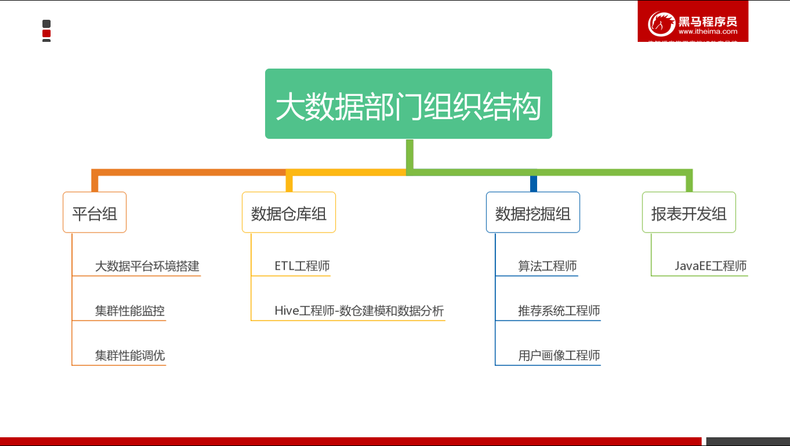

## 分布式技术

### 为什么需要分布式

#### 计算问题

无论是我们在学校刚开始学编程，还是在刚参加工作开始处理实际问题，写出来的程序都是很简单的。因为面对的问题很简单。以处理数据为例，可能只是把一个几十K的文件解析下，然后生成一个词频分析的报告。很简单的程序，十几行甚至几行就搞定了。

直到有一天，给你扔过来1000个文件，有些还特别大，好几百M了。你用之前的程序一跑，发现跑的时间有点长。于是想要去优化下。1000
个文件，互相还没业务联系，用多线程呀，一个线程处理一个文件，结果再汇总就搞定了。如果多线程效果不够好，比如像
Python 的多线程，没法利用多核的威力，那就用多进程。

无论是线程、进程，本质上，目的都是为了计算的并行化，解决的是算的慢的问题。而如果计算量足够大，就算榨干了机器的计算能力，也算不过来，咋办？

一台机器不够，那就多搞几台机器嘛。所以就从多线程/进程的计算并行化，进化到计算的分布式化（当然，分布式一定程度上也是并行化）。

#### 存储问题

另一方面，如果处理的数据有10T，而你手上的机器只有500G 的硬盘，怎么办？

一种办法是纵向扩展，搞一台几十T硬盘的机器；另一种是横向扩展，多搞几台机器，分散着放。前者很容易到瓶颈，毕竟数据无限，而一台机器的容量有限，所以在大数据量的情况下，只能选后者。把数据分散到多台机器，本质上解决的是存不下的问题。

同时，刚才提到计算分布式化后，总不能所以程序都去同一台机器读数据吧，这样效率必然会受到单台机器性能的拖累，比如磁盘
IO、网络带宽等，也就逼着数据存储也要分散到各个机器去了。基于这两个原因，数据存储也分布式起来了。

### 分布式系统概述

**分布式系统是一个硬件或软件组件分布在不同的网络计算机上，彼此之间仅仅通过消息传递进行通信和协调的系统。**简单来说就是一群独立计算机集合共同对外提供服务，但是对于系统的用户来说，就像是一台计算机在提供服务一样。

分布式意味着可以采用更多的普通计算机（相对于昂贵的大型机）组成分布式集群对外提供服务。计算机越多，CPU、内存、存储资源等也就越多，能够处理的并发访问量也就越大。

从分布式系统的概念中我们知道，各个主机之间通信和协调主要通过网络进行，所以，分布式系统中的计算机在空间上几乎没有任何限制，这些计算机可能被放在不同的机柜上，也可能被部署在不同的机房中，还可能在不同的城市中，对于大型的网站甚至可能分布在不同的国家和地区。

### 分布式实现方案

### **分布式系统**

小明的公司又3个系统：系统A，系统B和系统C，这三个系统所做的业务不同，被部署在3个独立的机器上运行，他们之间互相调用（当然是跨域网络的），通力合作完成公司的业务流程。

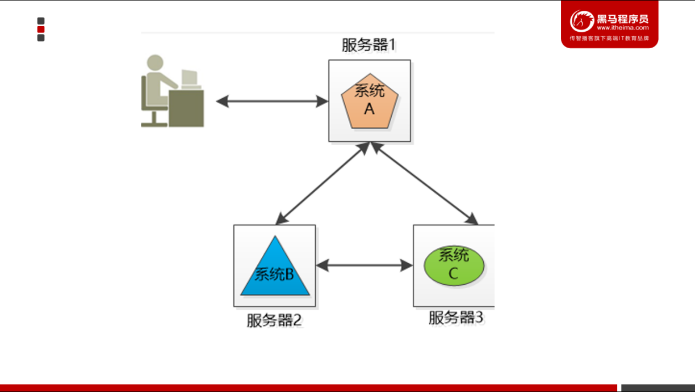

将不同的业务分部在不同的地方，就构成了一个分布式的系统，现在问题来了，系统A是整个分布式系统的脸面，用户直接访问，用户访问量大的时候要么是速度巨慢，要么直接挂掉，怎么办？

由于系统A只有一份，所以会引起单点失败。

### **集群（Cluster）**

小明的公司不差钱，就多买几台机器吧，
小明把系统A一下子部署了好几份（例如下图的3个服务器），每一份都是系统A的一个实例，对外提供同样的服务，这样，就不怕其中一个坏掉了，还有另外两个呢。

这三个服务器的系统就组成了一个集群。

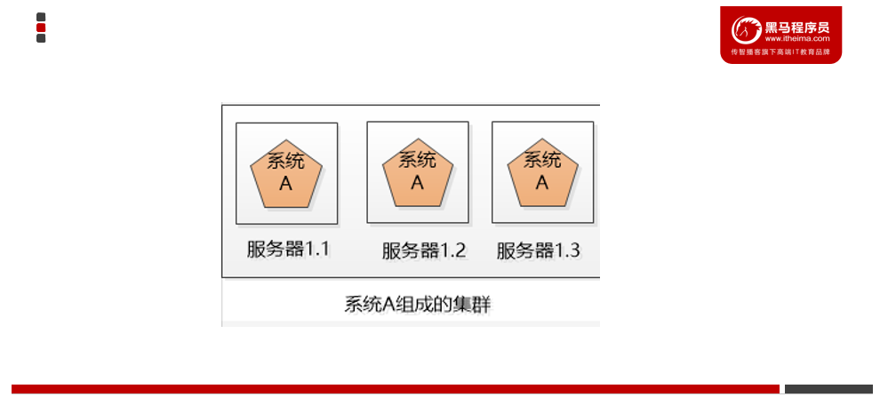

可是对用户来说，一下子出现这么多系统A，每个系统的IP地址都不一样，到底访问哪一个呢？

如果所有人都访问服务器1.1，那服务器1.1会被累死，剩下两个闲死，成了浪费钱的摆设。

### **负载均衡（Load Balancer）**

小明要尽可能的让3个机器上的系统A工作均衡一些，比如有3万个请求，那就让3个服务器各处理1万个（理想情况），这叫负载均衡

很明显，这个负载均衡的工作最好独立出来，放到独立的服务器上（例如nginx）：

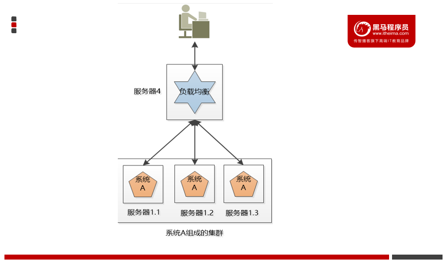

后来小明发现，这个负载均衡的服务器虽然工作内容简单，就是拿到请求，分发请求，但是它还是有可能挂掉，单点失败还是会出现。没办法，只好把负载均衡也搞成一个集群，这个集群和系统A的集群有两点不同：

1.我们可以用某种办法，让这个机器对外只提供一个IP地址，也就是用户看到的好像只有一个机器。

2.同一时刻，我们只让一个负载均衡的机器工作，另外一个原地待命，如果工作的那个拐到了，待命的那个就顶上去。

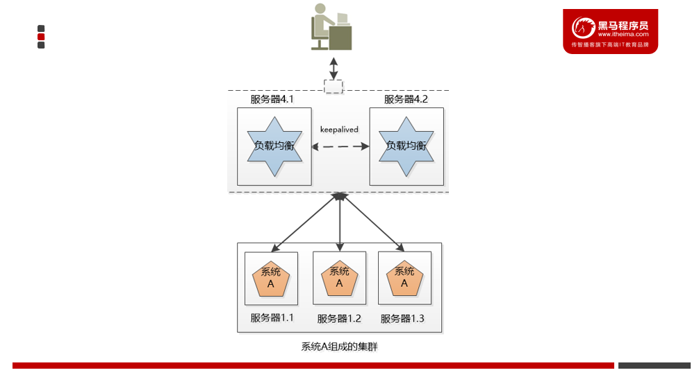

### **弹性(伸缩性)**

如果3个系统A的实例还是满足不了大量请求，例如双十一，可以申请增加服务器，双十一过后，新增的服务器闲置，成了摆设，于是小明决定尝试云计算，在云端可以轻松的创建，删除虚拟的服务器，那样就可以轻松的随着用户的请求动图的增减服务器了。

### **故障转移**

上面的系统看起来很美好，但是做了一个不切实际的假设：所有的服务都是无状态的，换句话说，假设用户的两次请求直接是没有关联的。但是现实是，大部分服务都是有状态的，例如购物车。

用户访问系统，在服务器上创建了一个购物车，并向其中加了几个商品，然后服务器1.1挂掉了，用户后续访问就找不到服务器1.1了，这时候就要做失效转移，让另外几个服务器去接管，去处理用户的请求。

可是问题来了，在服务器1.2,1.3上有用户的购物车吗？如果没有，用户就会抱怨，我刚创建的购物车哪里去了？还有更严重的，假设用户登录过得信息保存到了该服务器1.1上登录的，用户登录过的信息保存到了该服务器的session中，现在这个服务器挂了，用的session就不见了，会把用户踢到了登录界面，让用户再次登录！

处理不好状态的问题，集群的威力就大打折扣，无法完成真正的失效转移，甚至无法使用。

怎么办？

一种办法是把状态信息在集群的各个服务器之间复制，让集群的各个服务器达成一致。

还有一种办法，
就是把几种状态信息存储在一个地方，让集群服务器的各个服务器都能访问到。

## Hadoop概述

### Hadoop介绍

Hadoop是Apache旗下的一个用java语言实现开源软件框架，是一个开发和运行处理大规模数据的软件平台。允许使用简单的编程模型在大量计算机集群上对大型数据集进行分布式处理。

狭义上说，Hadoop指Apache这款开源框架，它的核心组件有：

**HDFS**（分布式文件系统）：解决海量数据存储

**YARN**（作业调度和集群资源管理的框架）：解决资源任务调度

**MAPREDUCE**（分布式运算编程框架）：解决海量数据计算

广义上来说，Hadoop通常是指一个更广泛的概念——Hadoop生态圈。

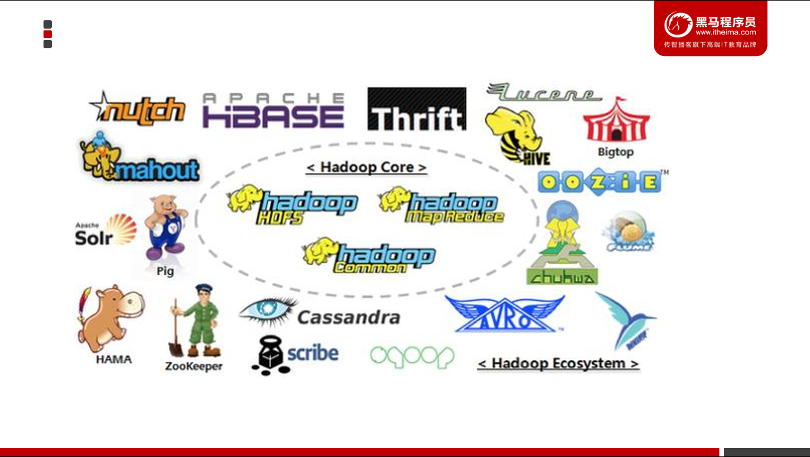

当下的Hadoop已经成长为一个庞大的体系，随着生态系统的成长，新出现的项目越来越多，其中不乏一些非Apache主管的项目，这些项目对HADOOP是很好的补充或者更高层的抽象。比如：

| **框架**  | **用途**                                                  |
|-----------|-----------------------------------------------------------|
| HDFS      |  分布式文件系统                                           |
| MapReduce | 分布式运算程序开发框架                                    |
| ZooKeeper | 分布式协调服务基础组件                                    |
| HIVE      | 基于HADOOP的分布式数据仓库，提供基于SQL的查询数据操作     |
| FLUME     | 日志数据采集框架                                          |
| oozie     | 工作流调度框架                                            |
| Sqoop     | 数据导入导出工具（比如用于mysql和HDFS之间）               |
| Impala    | 基于hive的实时sql查询分析                                 |
| Mahout    | 基于mapreduce/spark/flink等分布式运算框架的机器学习算法库 |

### Hadoop发展简史

Hadoop是Apache Lucene创始人 Doug Cutting
创建的。最早起源于Nutch，它是Lucene的子项目。Nutch的设计目标是构建一个大型的全网搜索引擎，包括网页抓取、索引、查询等功能，但随着抓取网页数量的增加，遇到了严重的可扩展性问题：如何解决数十亿网页的存储和索引问题。

2003年Google发表了一篇论文为该问题提供了可行的解决方案。论文中描述的是谷歌的产品架构，该架构称为：谷歌分布式文件系统（GFS）,可以解决他们在网页爬取和索引过程中产生的超大文件的存储需求。

2004年 Google发表论文向全世界介绍了谷歌版的MapReduce系统。

同时期，以谷歌的论文为基础，Nutch的开发人员完成了相应的开源实现HDFS和MAPREDUCE，并从Nutch中剥离成为独立项目HADOOP，到2008年1月，HADOOP成为Apache顶级项目，迎来了它的快速发展期。

2006年Google发表了论文是关于BigTable的，这促使了后来的Hbase的发展。

因此，Hadoop及其生态圈的发展离不开Google的贡献。

### Hadoop特性优点

**扩容能力（Scalable）：**Hadoop是在可用的计算机集群间分配数据并完成计算任务的，这些集群可用方便的扩展到数以千计的节点中。

**成本低（Economical）**：Hadoop通过普通廉价的机器组成服务器集群来分发以及处理数据，以至于成本很低。

**高效率（Efficient）：**通过并发数据，Hadoop可以在节点之间动态并行的移动数据，使得速度非常快。

**可靠性（Rellable）：**能自动维护数据的多份复制，并且在任务失败后能自动地重新部署（redeploy）计算任务。所以Hadoop的按位存储和处理数据的能力值得人们信赖。

### Hadoop国内外应用

#### Hadoop在国外应用的部分企业

##### **Yahoo**

Yahoo是Hadoop的最大支持者，Yahoo的Hadoop机器总节点数目已经超过42000个，有超过10万的核心CPU在运行Hadoop。最大的一个单Master节点集群有4500个节点（每个节点双路4核心CPUboxesw，4×1TB磁盘，16GBRAM）。总的集群存储容量大于350PB，每月提交的作业数目超过1000万个，在Pig中超过60%的Hadoop作业是使用Pig编写提交的。

Yahoo的Hadoop应用主要包括以下几个方面：

-   支持广告系统

-   用户行为分析

-   支持Web搜索

-   反垃圾邮件系统

-   个性化推荐

##### **Facebook**

主要用于存储内部日志的拷贝，作为一个源用于处理数据挖掘和日志统计。
主要使用了2个集群：一个由1100台节点组成的集群，包括8800核CPU（即每台机器8核）,和12000TB的原始存储(即每台机器12T硬盘)
一个有300台节点组成的集群，包括2400核CPU（即每台机器8核），和3000TB的原始存储(即每台机器12T硬盘)
由此基础上开发了基于SQL语法的项目：HIVE 。

Facebook使用Hadoop集群的机器节点超过1400台，共计11200个核心CPU，超过15PB原始存储容量，每个商用机器节点配置了8核CPU，12TB数据存储，主要使用StreamingAPI和JavaAPI编程接口。Facebook同时在Hadoop基础上建立了一个名为Hive的高级数据仓库框架，Hive已经正式成为基于Hadoop的Apache一级项目。

##### **IBM**

IBM蓝云也利用Hadoop来构建云基础设施。IBM蓝云使用的技术包括：Xen和PowerVM虚拟化的Linux操作系统映像及Hadoop并行工作量调度，并发布了自己的Hadoop发行版及大数据解决方案。

#### Hadoop在国内应用的部分企业

##### **百度**

Hadoop集群规模达到近十个，单集群超过2800台机器节点，Hadoop机器总数有上万台机器，总的存储容量超过100PB，已经使用的超过74PB，每天提交的作业数目有数千个之多，每天的输入数据量已经超过7500TB，输出超过1700TB。

百度的Hadoop集群为整个公司的数据团队、大搜索团队、社区产品团队、广告团队，以及LBS团体提供统一的计算和存储服务，主要应用包括：

-   数据挖掘与分析

-   日志分析平台

-   数据仓库系统

-   推荐引擎系统

-   用户行为分析系统

##### **阿里巴巴**

阿里巴巴的Hadoop集群大约有3200台服务器，大约30?000物理CPU核心，总内存100TB，总的存储容量超过60PB，每天的作业数目超过150?000个，每天hivequery查询大于6000个，每天扫描数据量约为7.5PB，每天扫描文件数约为4亿，存储利用率大约为80%，CPU利用率平均为65%，峰值可以达到80%。

Hadoop集群拥有150个用户组、4500个集群用户，为电子商务网络平台提供底层的基础计算和存储服务，主要应用包括：

-   数据平台系统

-   搜索支撑

-   电子商务数据

-   推荐引擎系统

-   搜索排行榜

##### **华为**

华为对Hadoop做出贡献的公司之一，排在Google和Cisco的前面，华为对Hadoop的HA方案，以及HBase领域有深入研究，并已经向业界推出了自己的基于Hadoop的大数据解决方案。

##### **腾讯**

TDW（Tencent distributed Data
Warehouse，腾讯分布式数据仓库）基于开源软件Hadoop和Hive进行构建，打破了传统数据仓库不能线性扩展、可控性差的局限，并且根据腾讯数据量大、计算复杂等特定情况进行了大量优化和改造。

TDW服务覆盖了腾讯绝大部分业务产品，单集群规模达到4400台，CPU总核数达到10万左右，存储容量达到100PB；每日作业数100多万，每日计算量4PB，作业并发数2000左右；实际存储数据量80PB，文件数和块数达到6亿多；存储利用率83%左右，CPU利用率85%左右。经过四年多的持续投入和建设，TDW已经成为腾讯最大的离线数据处理平台。TDW的功能模块主要包括：Hive、MapReduce、HDFS、TDBank、Lhotse等

### Hadoop的历史版本和发行版公司

#### Hadoop历史版本

-   1.x版本系列：hadoop版本当中的第二代开源版本，主要修复0.x版本的一些bug等，该版本已被淘汰

-   2.x版本系列：架构产生重大变化，引入了yarn平台等许多新特性,是现在使用的主流版本。

-   3.x版本系列：对HDFS、MapReduce、YARN都有较大升级，还新增了Ozone
    key-value存储。

#### Hadoop发行版公司

Hadoop发行版本分为**开源社区版**和**商业版**。社区版是指由Apache软件基金会维护的版本，是官方维护的版本体系。

商业版Hadoop是指由第三方商业公司在社区版Hadoop基础上进行了一些修改、整合以及各个服务组件兼容性测试而发行的版本，比较著名的有cloudera的CDH、mapR、hortonWorks等。

##### 社区版

**一、免费开源版本Apache:**

<http://hadoop.apache.org/>

优点：拥有全世界的开源贡献者，代码更新迭代版本比较快，

缺点：版本的升级，版本的维护，版本的兼容性，版本的补丁都可能考虑不太周到

Apache所有软件的下载地址（包括各种历史版本）：http://archive.apache.org/dist/

**二、免费开源版本HortonWorks：**

hortonworks主要是雅虎主导Hadoop开发的副总裁，带领二十几个核心成员成立Hortonworks，核心产品软件HDP（ambari），HDF免费开源，并且提供一整套的web管理界面，供我们可以通过web界面管理我们的集群状态，web管理界面软件HDF网址（**http://ambari.apache.org/**），2018年，大数据领域的两大巨头公司Cloudera和Hortonworks宣布平等合并，Cloudera以股票方式收购Hortonworks，Cloudera股东最终获得合并公司60%的股份

##### 收费版本

软件收费版本Cloudera:

<https://www.cloudera.com/>

cloudera主要是美国一家大数据公司在apache开源hadoop的版本上，通过自己公司内部的各种补丁，实现版本之间的稳定运行，大数据生态圈的各个版本的软件都提供了对应的版本，解决了版本的升级困难，版本兼容性等各种问题

在本课程中使用的是Apache版的Hadoop，版本号为：**3.1.4**。

### Hadoop架构

#### Hadoop 3.x的版本架构和模型介绍

由于Hadoop 2.0是基于JDK 1.7开发的，而JDK
1.7在2015年4月已停止更新，这直接迫使Hadoop社区基于JDK
1.8重新发布一个新的Hadoop版本，即hadoop 3.0。Hadoop
3.0中引入了一些重要的功能和优化，包括HDFS 可擦除编码、多Namenode支持、MR Native
Task优化、YARN基于cgroup的内存和磁盘IO隔离、YARN container resizing等。

Apache hadoop 项目组最新消息，hadoop3.x以后将会调整方案架构，将Mapreduce
基于内存+io+磁盘，共同处理数据。改变最大的是hdfs,hdfs
通过最近block块计算，根据最近计算原则，本地block块，加入到内存，先计算，通过IO，共享内存计算区域，最后快速形成计算结果，比Spark快10倍。

#### **Hadoop 3.0新特性**

Hadoop 3.0在功能和性能方面，对hadoop内核进行了多项重大改进，主要包括：

##### 通用性

1.精简Hadoop内核，包括剔除过期的API和实现，将默认组件实现替换成最高效的实现。

Classpath isolation：以防止不同版本jar包冲突

3.Shell脚本重构： Hadoop
3.0对Hadoop的管理脚本进行了重构，修复了大量bug，增加了新特性。

##### HDFS

Hadoop3.x中Hdfs在可靠性和支持能力上作出很大改观：

1.HDFS支持数据的擦除编码，这使得HDFS在不降低可靠性的前提下，节省一半存储空间。

2.多NameNode支持，即支持一个集群中，一个active、多个standby
namenode部署方式。注：多ResourceManager特性在hadoop 2.0中已经支持。

**HDFS纠删码**

在Hadoop3.X中，HDFS实现了Erasure Coding这个新功能。Erasure
coding纠删码技术简称EC，是一种数据保护技术.最早用于通信行业中数据传输中的数据恢复，是一种编码容错技术。

它通过在原始数据中加入新的校验数据，使得各个部分的数据产生关联性。在一定范围的数据出错情况下，通过纠删码技术都可以进行恢复。

hadoop-3.0之前，HDFS存储方式为每一份数据存储3份，这也使得存储利用率仅为1/3，hadoop-3.0引入纠删码技术(EC技术)，实现1份数据+0.5份冗余校验数据存储方式。

与副本相比纠删码是一种更节省空间的数据持久化存储方法。标准编码(比如Reed-Solomon(10,4))会有1.4
倍的空间开销；然而HDFS副本则会有3倍的空间开销。

**支持多个NameNodes**

最初的HDFS NameNode high-availability实现仅仅提供了一个active
NameNode和一个Standby
NameNode；并且通过将编辑日志复制到三个JournalNodes上，这种架构能够容忍系统中的任何一个节点的失败。

然而，一些部署需要更高的容错度。我们可以通过这个新特性来实现，其允许用户运行多个Standby
NameNode。比如通过配置三个NameNode和五个JournalNodes，这个系统可以容忍2个节点的故障，而不是仅仅一个节点。

##### MapReduce

Hadoop3.X中的MapReduce较之前的版本作出以下更改：

1.Tasknative优化：为MapReduce增加了C/C++的map output
collector实现（包括Spill，Sort和IFile等），通过作业级别参数调整就可切换到该实现上。对于shuffle密集型应用，其性能可提高约30%。

2.MapReduce内存参数自动推断。在Hadoop
2.0中，为MapReduce作业设置内存参数非常繁琐，一旦设置不合理，则会使得内存资源浪费严重，在Hadoop3.0中避免了这种情况。

Hadoop3.x中的MapReduce添加了Map输出collector的本地实现，对于shuffle密集型的作业来说，这将会有30%以上的性能提升。

##### 其他

**默认端口更改**

在hadoop3.x之前，多个Hadoop服务的默认端口都属于Linux的临时端口范围（32768-61000）。这就意味着用户的服务在启动的时候可能因为和其他应用程序产生端口冲突而无法启动。

现在这些可能会产生冲突的端口已经不再属于临时端口的范围，这些端口的改变会影响NameNode,
Secondary NameNode,
DataNode以及KMS。与此同时，官方文档也进行了相应的改变，具体可以参见
HDFS-9427以及HADOOP-12811。

Namenode ports: 50470 --\> 9871, 50070--\> 9870, 8020 --\> 9820

Secondary NN ports: 50091 --\> 9869,50090 --\> 9868

Datanode ports: 50020 --\> 9867, 50010--\> 9866, 50475 --\> 9865, 50075 --\>
9864

Kms server ports: 16000 --\> 9600 (原先的16000与HMaster端口冲突)

**YARN 资源类型**

YARN 资源模型（YARN resource
model）已被推广为支持用户自定义的可数资源类型（support user-defined countable
resource types），不仅仅支持 CPU 和内存。

比如集群管理员可以定义诸如 GPUs、软件许可证（software
licenses）或本地附加存储器（locally-attached storage）之类的资源。YARN
任务可以根据这些资源的可用性进行调度。

## Hadoop集群搭建

### 集群简介

HADOOP集群具体来说包含两个集群：HDFS集群和YARN集群，两者逻辑上分离，但物理上常在一起。

**HDFS集群负责海量数据的存储，**集群中的角色主要有：

NameNode、DataNode、SecondaryNameNode

**YARN集群负责海量数据运算时的资源调度**，集群中的角色主要有：

ResourceManager、NodeManager

那mapreduce是什么呢？它其实是一个分布式运算编程框架，是应用程序开发包，由用户按照编程规范进行程序开发，后打包运行在HDFS集群上，并且受到YARN集群的资源调度管理。

### 集群部署方式

**Hadoop部署方式分三种：**

#### standalone mode（独立模式）

独立模式又称为单机模式，仅1个机器运行1个java进程，主要用于调试。

#### Pseudo-Distributed mode（伪分布式模式）

伪分布模式也是在1个机器上运行HDFS的NameNode和DataNode、YARN的
ResourceManger和NodeManager，但分别启动单独的java进程，主要用于调试。

#### Cluster mode（群集模式）

集群模式主要用于生产环境部署。会使用N台主机组成一个Hadoop集群。这种部署模式下，主节点和从节点会分开部署在不同的机器上。

### hadoop重新编译

#### 为什么要编译hadoop？

由于appache给出的hadoop的安装包没有提供带**C程序访问的接口**，所以我们在使用本地库（本地库可以用来做压缩，以及支持C程序等等）的时候就会出问题,需要对Hadoop源码包进行重新编译，请注意，资料中已经提供好了编译过的Hadoop安装包，所以这一部分的操作，大家可以不用做，了解即可。

#### Hadoop编译文档

Hadoop的编译步骤可以参考:1_Hadoop编译文档.docx文档

### Hadoopn集群安装

集群模式主要用于生产环境部署，需要多台主机，并且这些主机之间可以相互访问，我们在之前搭建好基础环境的三台虚拟机上进行Hadoop的搭建。

#### 集群规划

本课程搭建的是集群模式，以三台主机为例，以下是集群规划:

| 节点信息          | 10G/ 2cores       | 7G / 2cores     | 7G / 2cores     |   |
|-------------------|-------------------|-----------------|-----------------|---|
|                   | node1.itcast.cn   | node2.itcast.cn | node3.itcast.cn |   |
| HDFS集群 守护进程 | NameNode          | √               | ×               | × |
|                   | SecondaryNameNode | ×               | √               | × |
|                   | DataNode          | √               | √               | √ |
| YARN集群 守护进程 | ResourceManager   | √               | ×               | × |
|                   | NodeManager       | √               | √               | √ |

#### 解压Hadoop安装包

| 上传解压hadoop 3.1.4安装文件 cd /export/software rz  解压 tar -xvzf hadoop-3.1.4.tar.gz -C ../server  \# 在每个节点中创建用于存放数据的data目录 \# NameNode数据 mkdir -p /export/server/hadoop-3.1.4/data/namenode \# DataNode数据 mkdir -p /export/server/hadoop-3.1.4/data/datanode |
|---------------------------------------------------------------------------------------------------------------------------------------------------------------------------------------------------------------------------------------------------------------------------------------|

#### 准备安装环境

| 上传解压hadoop 3.1.4安装文件 cd /export/software rz  解压 tar -xvzf hadoop-3.1.4.tar.gz -C ../server  \# 在每个节点中创建用于存放数据的data目录 \# NameNode数据 mkdir -p /export/server/hadoop-3.1.4/data/namenode \# DataNode数据 mkdir -p /export/server/hadoop-3.1.4/data/datanode |
|---------------------------------------------------------------------------------------------------------------------------------------------------------------------------------------------------------------------------------------------------------------------------------------|

#### 编辑配置文件

##### 配置NameNode（core-site.xml）

| cd /export/server/hadoop-3.1.4/etc/hadoop vim core-site.xml -------------------------------- 在第19行下添加以下内容： \<property\>  \<name\>fs.defaultFS\</name\>  \<value\>hdfs://node1.itcast.cn:9820\</value\>  \<description\>配置NameNode的URL\</description\> \</property\> |
|-----------------------------------------------------------------------------------------------------------------------------------------------------------------------------------------------------------------------------------------------------------------------------------|

##### 配置HDFS路径（hdfs-site.xml）

| vim hdfs-site.xml -------------------------------- 在第20行下添加以下内容： \<property\>  \<name\>dfs.namenode.name.dir\</name\>  \<value\>/export/server/hadoop-3.1.4/data/namenode\</value\>  \<description\>NameNode存储名称空间和事务日志的本地文件系统上的路径\</description\> \</property\> \<property\>  \<name\>dfs.datanode.data.dir\</name\>  \<value\>/export/server/hadoop-3.1.4/data/datanode\</value\>  \<description\>DataNode存储名称空间和事务日志的本地文件系统上的路径\</description\> \</property\> |
|-------------------------------------------------------------------------------------------------------------------------------------------------------------------------------------------------------------------------------------------------------------------------------------------------------------------------------------------------------------------------------------------------------------------------------------------------------------------------------------------------------------------------|

##### 配置YARN（yarn-site.xml）

| **vim yarn-site.xml** -------------------------------- 在第18行下添加以下内容： \<property\>   \<name\>yarn.nodemanager.aux-services\</name\>  \<value\>mapreduce_shuffle\</value\>  \</property\> \<property\>  \<name\>yarn.scheduler.minimum-allocation-mb\</name\>  \<value\>512\</value\>  \<description\>为每个容器请求分配的最小内存限制资源管理器（512M）\</description\> \</property\> \<property\>  \<name\>yarn.scheduler.maximum-allocation-mb\</name\>  \<value\>4096\</value\>  \<description\>为每个容器请求分配的最大内存限制资源管理器（4G）\</description\> \</property\> \<property\>  \<name\>yarn.nodemanager.vmem-pmem-ratio\</name\>  \<value\>4\</value\>  \<description\>虚拟内存比例，默认为2.1，此处设置为4倍\</description\> \</property\> |
|------------------------------------------------------------------------------------------------------------------------------------------------------------------------------------------------------------------------------------------------------------------------------------------------------------------------------------------------------------------------------------------------------------------------------------------------------------------------------------------------------------------------------------------------------------------------------------------------------------------------------------------------------------------------------------------------------------------------------------------------------------------------|

##### 配置MapReduce（mapred-site.xml）

| **vim mapred-site.xml** ---------------------------------- 在第20行下添加以下内容： \<property\>  \<name\>mapreduce.framework.name\</name\>  \<value\>yarn\</value\>  \<description\>执行MapReduce的方式：yarn/local\</description\> \</property\> \<property\>  \<name\>yarn.app.mapreduce.am.env\</name\>  \<value\>HADOOP_MAPRED_HOME=\${HADOOP_HOME}\</value\> \</property\> \<property\>  \<name\>mapreduce.map.env\</name\>  \<value\>HADOOP_MAPRED_HOME=\${HADOOP_HOME}\</value\> \</property\> \<property\>  \<name\>mapreduce.reduce.env\</name\>  \<value\>HADOOP_MAPRED_HOME=\${HADOOP_HOME}\</value\> \</property\> |
|---------------------------------------------------------------------------------------------------------------------------------------------------------------------------------------------------------------------------------------------------------------------------------------------------------------------------------------------------------------------------------------------------------------------------------------------------------------------------------------------------------------------------------------------------------------------------------------------------------------------------------|

##### workers文件

| **vim /export/server/hadoop-3.1.4/etc/hadoop/workers** ---------------------------------- \# 删除第一行localhost，然后添加以下三行 node1.itcast.cn node2.itcast.cn node3.itcast.cn |
|------------------------------------------------------------------------------------------------------------------------------------------------------------------------------------|

##### 修改hadoop.env环境变量

| hadoop.env文件 **vim /export/server/hadoop-3.1.4/etc/hadoop/hadoop-env.sh**  修改第54行为： export JAVA_HOME=/export/server/jdk1.8.0_241 |
|------------------------------------------------------------------------------------------------------------------------------------------|

##### 配置环境变量

| **vim /etc/profile** export HADOOP_HOME=/export/server/hadoop-3.1.4 export PATH=\$PATH:\${HADOOP_HOME}/bin:\${HADOOP_HOME}/sbin:  source /etc/profile |
|-------------------------------------------------------------------------------------------------------------------------------------------------------|

**SecureCRT全部退出，重新远程连接**

#### 分发配置好的Hadoop安装文件和环境变量

| cd /export/server/ scp -r hadoop-3.1.4 node2.itcast.cn:\$PWD scp -r hadoop-3.1.4 node3.itcast.cn:\$PWD scp /etc/profile node2.itcast.cn:/etc scp /etc/profile node3.itcast.cn:/etc 在每个节点上执行 source /etc/profile |
|-------------------------------------------------------------------------------------------------------------------------------------------------------------------------------------------------------------------------|

#### 格式化HDFS

**首次启动HDFS时，必须对其进行格式化操作**。本质上是一些清理和准备工作，因为此时的HDFS在物理上还是不存在的。

| cd /export/server/hadoop-3.1.4 bin/hdfs namenode -format itcast-hadoop |
|------------------------------------------------------------------------|

#### 启动Hadoop集群

要启动Hadoop集群，需要启动HDFS和YARN两个集群。

##### 启动HDFS集群

| -- 4.1 选择node1.itcast.cn节点启动NameNode节点 hdfs --daemon start namenode  -- 4.2 在所有节点上启动DataNode hdfs --daemon start datanode  -- 4.3 启动Secondary NameNode hdfs --daemon start secondarynamenode |
|----------------------------------------------------------------------------------------------------------------------------------------------------------------------------------------------------------------|

##### 启动YARN集群

| -- 4.3 选择node1.itcast.cn节点启动ResourceManager节点 yarn --daemon start resourcemanager  -- 4.4 在所有节点上启动NodeManager yarn --daemon start nodemanager |
|---------------------------------------------------------------------------------------------------------------------------------------------------------------|

注意:如果在启动之后，有些服务没有启动成功，则需要查看启动日志，Hadoop的启动日志在每台主机的/export/server/hadoop-x.x.x/logs/目录，需要根据哪台主机的哪个服务启动情况去对应的主机上查看相应的日志，以下是node1主机的日志目录.

#### 关闭Hadoop集群

##### 关闭HDFS集群

| \# 5.1 关闭NameNode hdfs --daemon stop namenode  \# 5.2 每个节点关闭DataNode hdfs --daemon stop datanode  \# 关闭Secondary NameNode hdfs --daemon stop secondarynamenode |
|--------------------------------------------------------------------------------------------------------------------------------------------------------------------------|

##### 关闭YARN集群

| \# 5.3 每个节点关闭ResourceManager yarn --daemon stop resourcemanager  \# 5.4 每个节点关闭NodeManager yarn --daemon stop nodemanager |
|--------------------------------------------------------------------------------------------------------------------------------------|

#### 一键启动、关闭

Hadoop 3中不允许使用root用户来一键启动集群

| Starting resourcemanager ERROR: Attempting to operate on yarn resourcemanager as root ERROR: but there is no YARN_RESOURCEMANAGER_USER defined. Aborting operation. Starting nodemanagers ERROR: Attempting to operate on yarn nodemanager as root ERROR: but there is no YARN_NODEMANAGER_USER defined. Aborting operation. |
|------------------------------------------------------------------------------------------------------------------------------------------------------------------------------------------------------------------------------------------------------------------------------------------------------------------------------|

##### 修改配置配置启动用户

##### HDFS集群一键脚本

| cd /export/server/hadoop-3.1.4/sbin  编辑start-dfs.sh、stop-dfs.sh 在两个文件顶部添加以下内容： HDFS_DATANODE_USER=root HDFS_DATANODE_SECURE_USER=hdfs HDFS_NAMENODE_USER=root HDFS_SECONDARYNAMENODE_USER=root |
|-----------------------------------------------------------------------------------------------------------------------------------------------------------------------------------------------------------------|

##### YARN集群一键脚本

| start-yarn.sh、stop-yarn.sh 在两个文件顶部添加以下内容： YARN_RESOURCEMANAGER_USER=root HADOOP_SECURE_DN_USER=yarn YARN_NODEMANAGER_USER=root |
|-----------------------------------------------------------------------------------------------------------------------------------------------|

##### 一键启动

| -- 一键启动HDFS、YARN start-dfs.sh start-yarn.sh |
|--------------------------------------------------|

##### 一键关闭

| stop-dfs.sh stop-yarn.sh |
|--------------------------|

为了方便在windows上访问Hadoop，我们可以配置一个域名映射，就是以后我们只需要输入node1.itcast.cn，就会自动映射为对应的ip地址。

#### 配置windows域名映射

1.  以管理员身份打开C:\\Windows\\System32\\drivers\\etc目录下的hosts文件

2.  在文件最后添加以下映射域名和ip映射关系

| 192.168.88.100 node1.itcast.cn 192.168.88.101 node2.itcast.cn 192.168.88.102 node3.itcast.cn |
|----------------------------------------------------------------------------------------------|

1.  保存退出

2.  测试映射是否生效

| C:\\Users\\China\>**ping node1.itcast.cn** 正在 Ping node1.itcast.cn [192.168.88.100] 具有 32 字节的数据: 来自 192.168.88.100 的回复: 字节=32 时间\<1ms TTL=64 来自 192.168.88.100 的回复: 字节=32 时间\<1ms TTL=64  C:\\Users\\China\>**ping node2.itcast.cn** 正在 Ping node2.itcast.cn [192.168.88.101] 具有 32 字节的数据: 来自 192.168.88.101 的回复: 字节=32 时间\<1ms TTL=64 192.168.88.101 的 Ping 统计信息:  数据包: 已发送 = 1，已接收 = 1，丢失 = 0 (0% 丢失)，  C:\\Users\\China\>**ping node3.itcast.cn** 正在 Ping node3.itcast.cn [192.168.88.102] 具有 32 字节的数据: 来自 192.168.88.102 的回复: 字节=32 时间=9ms TTL=64 来自 192.168.88.102 的回复: 字节=32 时间\<1ms TTL=64 来自 192.168.88.102 的回复: 字节=32 时间\<1ms TTL=64 |
|-----------------------------------------------------------------------------------------------------------------------------------------------------------------------------------------------------------------------------------------------------------------------------------------------------------------------------------------------------------------------------------------------------------------------------------------------------------------------------------------------------------------------------------------------------------------------------------------------------------------------------------------------------------------------------------------------------------------------------------------------------|

#### 访问WebUI

NameNode: http://node1.itcast.cn:9870

YARN: <http://node1.itcast.cn:8088>

## Hadoop初体验

### 使用HDFS 

1.  从Linux本地上传一个文本文件到hdfs的/目录下

| \#在/export/data/目录中创建a.txt文件，并写入数据 **cd** **/**export**/**data**/** **touch** a.txt **echo** "hello" **\>** a.txt   \#将a.txt上传到HDFS的根目录 hadoop fs **-**put a.txt **/** |
|----------------------------------------------------------------------------------------------------------------------------------------------------------------------------------------------|

1.  通过页面查看

通过NameNode页面.进入HDFS：http://node1.itcast.cn:9870/

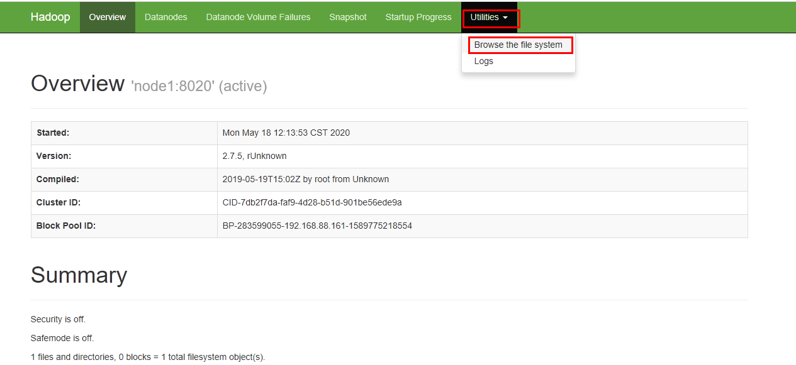

查看文件是否创建成功.

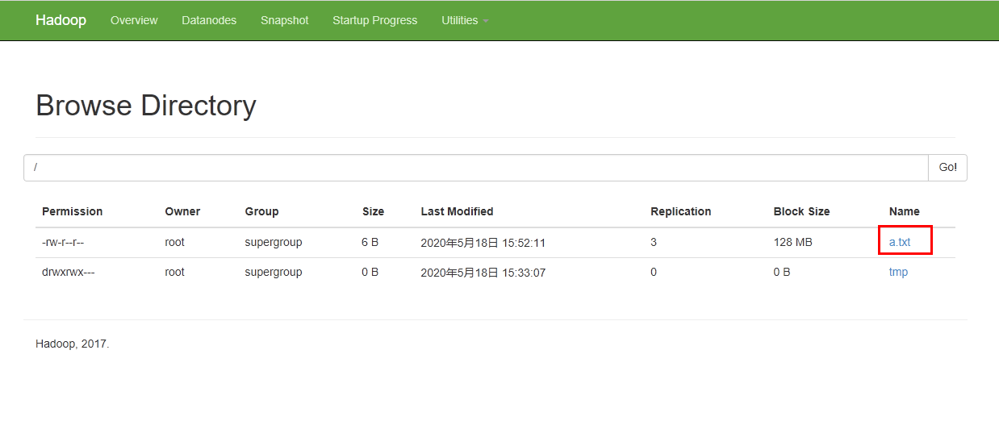

### 运行mapreduce程序

在Hadoop安装包的share/hadoop/mapreduce下有官方自带的mapreduce程序。我们可以使用如下的命令进行运行测试。（示例程序jar:hadoop-mapreduce-examples-3.1.4.jar计算圆周率）

| yarn jar /export/server/hadoop-3.1.4/share/hadoop/mapreduce/hadoop-mapreduce-examples-2.7.5.jar pi 2 50 |
|---------------------------------------------------------------------------------------------------------|

关于圆周率的估算，感兴趣的可以查询资料蒙特卡洛方法来计算Pi值，计算命令中2表示计算的线程数，50表示投点数，该值越大，则计算的pi值越准确。

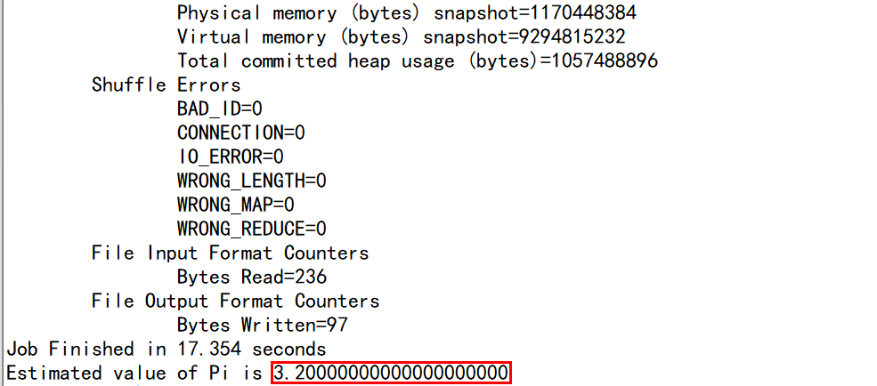

### 安装目录结构说明

#### Hadoop安装包目录结构

| bin     | Hadoop最基本的管理脚本和使用脚本的目录，这些脚本是sbin目录下管理脚本的基础实现，用户可以直接使用这些脚本管理和使用Hadoop。                           |
|---------|------------------------------------------------------------------------------------------------------------------------------------------------------|
| etc     | Hadoop配置文件所在的目录，包括core-site,xml、hdfs-site.xml、mapred-site.xml等从Hadoop1.0继承而来的配置文件和yarn-site.xml等Hadoop2.0新增的配置文件。 |
| include | 对外提供的编程库头文件（具体动态库和静态库在lib目录中），这些头文件均是用C++定义的，通常用于C++程序访问HDFS或者编写MapReduce程序。                   |
| lib     | 该目录包含了Hadoop对外提供的编程动态库和静态库，与include目录中的头文件结合使用。                                                                    |
| libexec | 各个服务对用的shell配置文件所在的目录，可用于配置日志输出、启动参数（比如JVM参数）等基本信息。                                                       |
| sbin    | Hadoop管理脚本所在的目录，主要包含HDFS和YARN中各类服务的启动/关闭脚本。                                                                              |
| share   | Hadoop各个模块编译后的jar包所在的目录，官方自带示例。                                                                                                |

#### Hadoop配置文件

##### hadoop-env.sh

文件中设置的是Hadoop运行时需要的环境变量。JAVA_HOME是必须设置的，即使我们当前的系统中设置了JAVA_HOME，它也是不认识的，因为Hadoop即使是在本机上执行，它也是把当前的执行环境当成远程服务器。

##### core-site.xml

hadoop的核心配置文件，有默认的配置项core-default.xml。

core-default.xml与core-site.xml的功能是一样的，如果在core-site.xml里没有配置的属性，则会自动会获取core-default.xml里的相同属性的值。

| 在该文件中的\<configuration\>标签中添加以下配置, \<configuration\>  在这里添加配置 \</configuration\> |
|-------------------------------------------------------------------------------------------------------|

##### hdfs-site.xml

HDFS的核心配置文件，主要配置HDFS相关参数，有默认的配置项hdfs-default.xml。

hdfs-default.xml与hdfs-site.xml的功能是一样的，如果在hdfs-site.xml里没有配置的属性，则会自动会获取hdfs-default.xml里的相同属性的值。

##### mapred-site.xml

MapReduce的核心配置文件，Hadoop默认只有个模板文件mapred-site.xml.template,需要使用该文件复制出来一份mapred-site.xml文件

##### yarn-site.xml

YARN的核心配置文件,在该文件中的\<configuration\>标签中添加以下配置,

##### workers

workers文件里面记录的是集群主机名。一般有以下两种作用：

1.  配合一键启动脚本如start-dfs.sh、stop-yarn.sh用来进行集群启动。这时候slaves文件里面的主机标记的就是从节点角色所在的机器。

2.  可以配合hdfs-site.xml里面dfs.hosts属性形成一种白名单机制。

dfs.hosts指定一个文件，其中包含允许连接到NameNode的主机列表。必须指定文件的完整路径名,那么所有在workers中的主机才可以加入的集群中。如果值为空，则允许所有主机。

## HDFS基准测试

实际生产环境当中，hadoop的环境搭建完成之后，第一件事情就是进行压力测试，测试Hadoop集群的读取和写入速度，测试网络带宽是否足够等一些基准测试。

#### 测试写入速度

向HDFS文件系统中写入数据,10个文件,每个文件10MB,文件存放到/benchmarks/TestDFSIO中

1.  启动YARN集群

| start-yarn.sh |
|---------------|

1.  启动写入基准测试

| hadoop jar /export/server/hadoop-3.1.4/share/hadoop/mapreduce/hadoop-mapreduce-client-jobclient-3.1.4-tests.jar TestDFSIO -write -nrFiles 10 -fileSize 10MB |
|-------------------------------------------------------------------------------------------------------------------------------------------------------------|

我们可以看到Hadoop启动了一个MapReduce作业来运行benchmark测试。

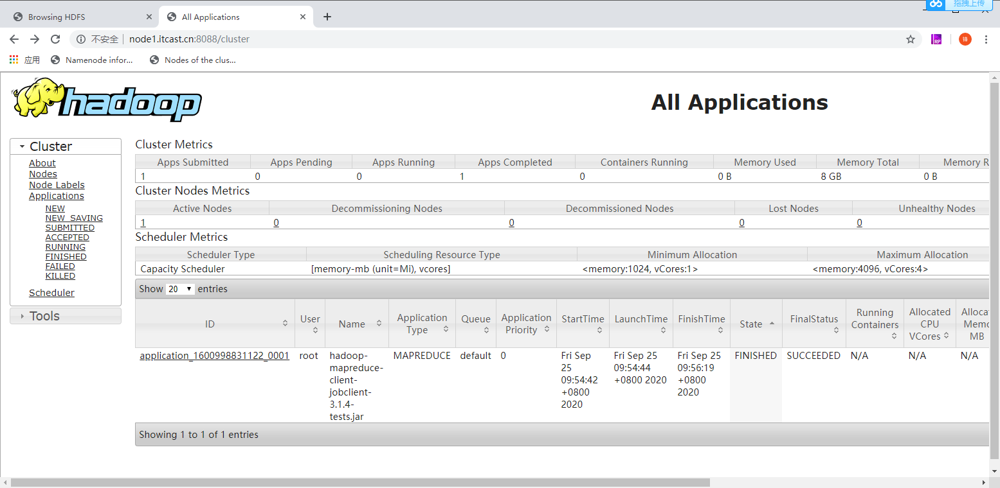

等待约2-5分钟，MapReduce程序运行成功后，就可以查看测试结果了。

1.  查看写入速度结果

| 2020-09-25 09:56:21,431 INFO fs.TestDFSIO: ----- TestDFSIO ----- : write 2020-09-25 09:56:21,431 INFO fs.TestDFSIO: Date & time: Fri Sep 25 09:56:21 CST 2020 2020-09-25 09:56:21,431 INFO fs.TestDFSIO: Number of files: 10 2020-09-25 09:56:21,431 INFO fs.TestDFSIO: Total MBytes processed: 100 2020-09-25 09:56:21,431 INFO fs.TestDFSIO: Throughput mb/sec: 0.48 2020-09-25 09:56:21,431 INFO fs.TestDFSIO: Average IO rate mb/sec: 2.82 2020-09-25 09:56:21,431 INFO fs.TestDFSIO: IO rate std deviation: 3.24 2020-09-25 09:56:21,431 INFO fs.TestDFSIO: Test exec time sec: 102.39 2020-09-25 09:56:21,431 INFO fs.TestDFSIO: |
|----------------------------------------------------------------------------------------------------------------------------------------------------------------------------------------------------------------------------------------------------------------------------------------------------------------------------------------------------------------------------------------------------------------------------------------------------------------------------------------------------------------------------------------------------------------------------------------------------------------------------------------|

我们看到目前在虚拟机上的IO吞吐量约为：0.48MB/s

#### 测试读取速度

测试hdfs的读取文件性能，在HDFS文件系统中读入10个文件,每个文件10M

| hadoop jar /export/server/hadoop-3.1.4/share/hadoop/mapreduce/hadoop-mapreduce-client-jobclient-3.1.4-tests.jar TestDFSIO **-**read **-**nrFiles 10 **-**fileSize 10MB |
|------------------------------------------------------------------------------------------------------------------------------------------------------------------------|

同样，Hadoop也会启动一个MapReduce程序来进行测试。

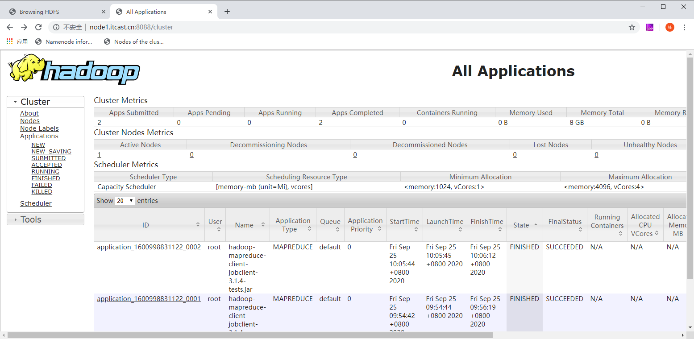

查看读取果

| 2020-09-25 10:06:14,023 INFO fs.TestDFSIO: ----- TestDFSIO ----- : read 2020-09-25 10:06:14,024 INFO fs.TestDFSIO: Date & time: Fri Sep 25 10:06:14 CST 2020 2020-09-25 10:06:14,024 INFO fs.TestDFSIO: Number of files: 10 2020-09-25 10:06:14,024 INFO fs.TestDFSIO: Total MBytes processed: 100 2020-09-25 10:06:14,024 INFO fs.TestDFSIO: Throughput mb/sec: 118.62 2020-09-25 10:06:14,024 INFO fs.TestDFSIO: Average IO rate mb/sec: 162.19 2020-09-25 10:06:14,024 INFO fs.TestDFSIO: IO rate std deviation: 76.44 2020-09-25 10:06:14,024 INFO fs.TestDFSIO: Test exec time sec: 30.14 2020-09-25 10:06:14,024 INFO fs.TestDFSIO: |
|-------------------------------------------------------------------------------------------------------------------------------------------------------------------------------------------------------------------------------------------------------------------------------------------------------------------------------------------------------------------------------------------------------------------------------------------------------------------------------------------------------------------------------------------------------------------------------------------------------------------------------------------|

可以看到读取的吞吐量为：118Mb/s

#### 清除测试数据

测试期间，会在HDFS集群上创建 /benchmarks目录，测试完毕后，我们可以清理该目录。

| [root@node1 mapreduce]\# **hdfs dfs -ls -R /benchmarks** drwxr-xr-x - root supergroup 0 2020-09-25 10:05 /benchmarks/TestDFSIO drwxr-xr-x - root supergroup 0 2020-09-25 10:05 /benchmarks/TestDFSIO/io_control -rw-r--r-- 3 root supergroup 112 2020-09-25 10:05 /benchmarks/TestDFSIO/io_control/in_file_test_io_0 -rw-r--r-- 3 root supergroup 112 2020-09-25 10:05 /benchmarks/TestDFSIO/io_control/in_file_test_io_1 -rw-r--r-- 3 root supergroup 112 2020-09-25 10:05 /benchmarks/TestDFSIO/io_control/in_file_test_io_2 -rw-r--r-- 3 root supergroup 112 2020-09-25 10:05 /benchmarks/TestDFSIO/io_control/in_file_test_io_3 -rw-r--r-- 3 root supergroup 112 2020-09-25 10:05 /benchmarks/TestDFSIO/io_control/in_file_test_io_4 -rw-r--r-- 3 root supergroup 112 2020-09-25 10:05 /benchmarks/TestDFSIO/io_control/in_file_test_io_5 -rw-r--r-- 3 root supergroup 112 2020-09-25 10:05 /benchmarks/TestDFSIO/io_control/in_file_test_io_6 -rw-r--r-- 3 root supergroup 112 2020-09-25 10:05 /benchmarks/TestDFSIO/io_control/in_file_test_io_7 -rw-r--r-- 3 root supergroup 112 2020-09-25 10:05 /benchmarks/TestDFSIO/io_control/in_file_test_io_8 -rw-r--r-- 3 root supergroup 112 2020-09-25 10:05 /benchmarks/TestDFSIO/io_control/in_file_test_io_9 drwxr-xr-x - root supergroup 0 2020-09-25 09:56 /benchmarks/TestDFSIO/io_data -rw-r--r-- 3 root supergroup 10485760 2020-09-25 09:56 /benchmarks/TestDFSIO/io_data/test_io_0 …… |
|---------------------------------------------------------------------------------------------------------------------------------------------------------------------------------------------------------------------------------------------------------------------------------------------------------------------------------------------------------------------------------------------------------------------------------------------------------------------------------------------------------------------------------------------------------------------------------------------------------------------------------------------------------------------------------------------------------------------------------------------------------------------------------------------------------------------------------------------------------------------------------------------------------------------------------------------------------------------------------------------------------------------------------------------------------------------------------------------------------------------------------------------------------------------------------------------------------------------------------------------------------------------------------------------------------------------------------------------------------------------------------------------------------------------------------------------------|

执行清理：

| hadoop jar /export/server/hadoop-3.1.4/share/hadoop/mapreduce/hadoop-mapreduce-client-jobclient-3.1.4-tests.jar TestDFSIO **-**clean |
|--------------------------------------------------------------------------------------------------------------------------------------|

删除命令会将 /benchmarks目录中内容删除

| [root@node1 mapreduce]\# hadoop jar /export/server/hadoop-3.1.4/share/hadoop/mapreduce/hadoop-mapreduce-client-jobclient-3.1.4-tests.jar TestDFSIO -clean 2020-09-25 10:11:03,278 INFO fs.TestDFSIO: TestDFSIO.1.8 2020-09-25 10:11:03,280 INFO fs.TestDFSIO: nrFiles = 1 2020-09-25 10:11:03,280 INFO fs.TestDFSIO: nrBytes (MB) = 1.0 2020-09-25 10:11:03,280 INFO fs.TestDFSIO: bufferSize = 1000000 2020-09-25 10:11:03,280 INFO fs.TestDFSIO: baseDir = /benchmarks/TestDFSIO 2020-09-25 10:11:03,892 INFO fs.TestDFSIO: Cleaning up test file |
|-----------------------------------------------------------------------------------------------------------------------------------------------------------------------------------------------------------------------------------------------------------------------------------------------------------------------------------------------------------------------------------------------------------------------------------------------------------------------------------------------------------------------------------------------------|
